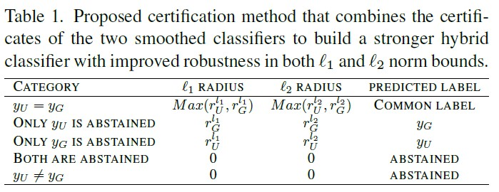

# NU-Certified-Robustness
[CVPRw 2023] Source Code for our Work "Certified Adversarial Robustness Within Multiple Perturbation Bounds"

Soumalya Nandi, Sravanti Addepalli, Harsh Rangwani, R. Venkatesh Babu\
Video Analytics Lab, Indian Institute of Science, Bengaluru

# TLDR
Make model certifiably robust against both $l_1$ and $l_2$ norm perturbations simultaneously by training with Normal-Uniform noise augmented images and certifying with a hybrid smoothed classifier.



# Training
```
python3 code/train.py dataset = "cifar10" arch = "cifar_resnet110" outdir = {path_to_output_location} --epochs 300 --batch 400 --noise_sd_gauss 1.00 --noise_sd_unif 0.866 --sim_reg 3 --beta 2 --log_file_name {"filename"} --checkpoint_name {"checkpoint_name"}
```

# Prediction
```
python3 code/predict.py dataset = "cifar10" base_classifier = {"path to the saved trained model"} noise_sd_gauss = 1.00 noise_sd_unif = 1.16 outfile = {"path_to_output_file_location"} --skip 1 --N 100
```

# Certification
```
python3 code/certify.py dataset = "cifar10" base_classifier = {"path to the saved trained model"} noise_sd_gauss = 1.00 noise_sd_unif = 1.16 outfile = {"path_to_output_file_location"} --skip 1 --start 0
```

# To generate plots like below


```
python3 code/analyze.py --Gauss_smoothing_file {"path_to_gaussian_smoothing_output_file"} --Unif_smoothing_file {"path_to_uniform_smoothing_output_file"} --Gauss_legend "Gaussian Smoothing $\sigma = 0.25$" --Unif_legend "Uniform Smoothing $\sigma = 0.25$" --outfile {"path to output image"}
```

# Results


## Citation
```
@InProceedings{Nandi_2023_CVPR,
    author    = {Nandi, Soumalya and Addepalli, Sravanti and Rangwani, Harsh and Babu, R. Venkatesh},
    title     = {Certified Adversarial Robustness Within Multiple Perturbation Bounds},
    booktitle = {Proceedings of the IEEE/CVF Conference on Computer Vision and Pattern Recognition (CVPR) Workshops},
    month     = {June},
    year      = {2023},
    pages     = {2297-2304}
}
```

